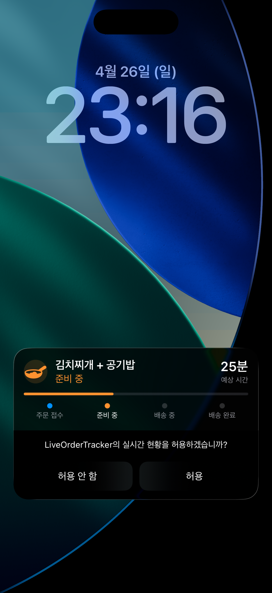
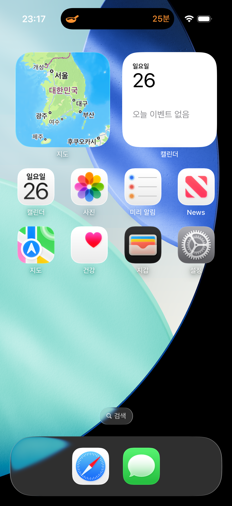
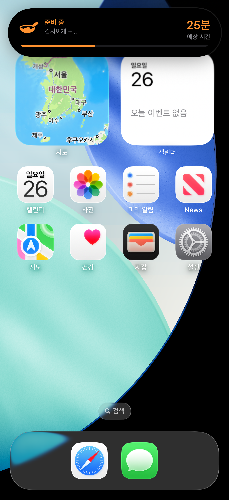

# LiveOrderTracker

> 주문 상태를 **Live Activity** 와 **Dynamic Island** 로 실시간 추적하는 iOS 샘플

커머스 앱의 핵심 UX 인 "주문 후 상태 추적" 흐름을 Lock Screen Live Activity 와 iPhone 14 Pro 이상 기기의 Dynamic Island 에 모두 대응하여 구현한 샘플입니다.

## Demo

| Lock Screen | Dynamic Island (Compact) | Dynamic Island (Expanded) |
|:---:|:---:|:---:|
|  |  |  |
| 잠금 화면 Live Activity — 상품명 / 상태 / 진행률 / 예상 시간 / 4단계 마커 | 컴팩트 — 좌측 상태 아이콘 + 우측 예상 시간 | 익스팬디드 — 상태 + 상품명 + 진행률 바 + 예상 시간 |

## Features

- **4단계 주문 상태 흐름**: 주문 접수 → 준비 중 → 배송 중 → 배송 완료
- **Lock Screen Live Activity**: 상품명 / 상태 아이콘 / 진행률 / 예상 시간 / 단계별 마커
- **Dynamic Island** 3가지 프레젠테이션 모두 구현
  - **Minimal** — 상태 아이콘 1개
  - **Compact** — Leading 아이콘 + Trailing 예상 시간
  - **Expanded** — 상태 + 상품명 + 진행률 바 + 예상 시간
- **상태 변경 시 활성 Live Activity 갱신** — `Activity.update(_:)` 사용
- **배송 완료 후 자동 종료** — 3초 뒤 `Activity.end(_:dismissalPolicy:)` 호출
- **deep link** — `liveordertracker://order/{orderId}` 위젯 탭 시 진입 가능

## Tech Stack

- **iOS 17.0+** / Swift 5
- **ActivityKit** — `ActivityAttributes`, `Activity<>`, `ActivityContent`
- **WidgetKit** — `ActivityConfiguration`, `DynamicIsland`
- **SwiftUI** — Live Activity / Dynamic Island UI 전체
- 외부 의존성 0

## Architecture

```
LiveOrderTracker/
├── Shared/                              # App ↔ Widget Extension 공유
│   ├── OrderStatus.swift                # 4단계 enum (progress, icon, tint)
│   └── OrderActivityAttributes.swift    # ActivityAttributes + ContentState
│
├── LiveOrderTracker/                    # Main App (SwiftUI)
│   ├── App/
│   │   └── LiveOrderTrackerApp.swift
│   ├── Views/
│   │   └── ContentView.swift            # 주문 시작 / 다음 단계 / 종료 UI
│   ├── Manager/
│   │   └── LiveActivityManager.swift    # @MainActor singleton
│   └── Info.plist                       # NSSupportsLiveActivities = YES
│
└── LiveOrderTrackerWidget/              # Widget Extension
    ├── LiveOrderTrackerWidgetBundle.swift
    ├── OrderLiveActivity.swift          # ActivityConfiguration + DynamicIsland
    └── Info.plist
```

### 핵심 설계 포인트

**1. App ↔ Widget 사이 타입 공유**

`ActivityAttributes` 와 `OrderStatus` 를 `Shared/` 폴더에 두고 양쪽 타겟 모두에 멤버십 추가. `ContentState` / `Attributes` 모두 `Sendable + Codable + Hashable`.

**2. Live Activity 라이프사이클**

```swift
// 시작
Activity.request(attributes: ..., content: ..., pushType: nil)

// 갱신
await activity.update(ActivityContent(state: ..., staleDate: ...))

// 종료
await activity.end(ActivityContent(state: ..., staleDate: nil),
                   dismissalPolicy: .immediate)
```

**3. Dynamic Island 3 가지 프레젠테이션**

`ActivityConfiguration` 의 `dynamicIsland:` 빌더 안에서 `DynamicIsland { Expanded } compactLeading: { } compactTrailing: { } minimal: { }` 4개 상태를 모두 정의해야 함. 한쪽만 빠지면 해당 상태에서 빈 UI 가 노출됨.

## Setup

```bash
# 1. XcodeGen 으로 프로젝트 생성
brew install xcodegen
cd LiveOrderTracker
xcodegen generate

# 2. Xcode 열기
open LiveOrderTracker.xcodeproj

# 3. iPhone 14 Pro 이상 시뮬레이터 또는 실기기 선택 후 실행
```

> Dynamic Island 는 iPhone 14 Pro 이상 시뮬레이터에서만 노출됩니다.
> Lock Screen Live Activity 는 모든 iPhone 시뮬레이터에서 확인 가능합니다.

## How to Test

1. 앱 실행
2. **주문 시작** 버튼 → 잠금 화면 / Dynamic Island 에 Live Activity 표시 확인
3. **다음** 버튼 → 상태 단계별 갱신 확인 (`Activity.update`)
4. 배송 완료 → 3초 뒤 자동 종료 (`Activity.end`)
5. **잠금 화면 확인** — 시뮬레이터에서 `Cmd + L` 또는 메뉴의 **Device > Lock**

## Requirements

- iOS 17.0+
- Xcode 15.0+
- XcodeGen (프로젝트 생성용)

## License

MIT
